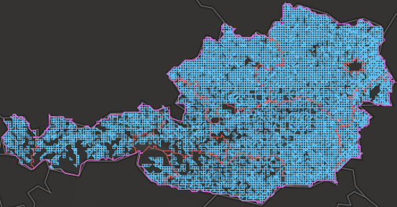
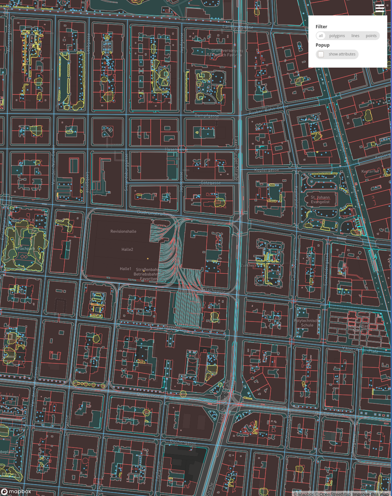

## Convert ESRI's Vector Tile Package (VTPK) to mbtiles

Resulting mbtiles can be used with [mapbox-gl-js (Web)](https://github.com/mapbox/mapbox-gl-js), [mapbox-gl-native (iOS/Android)](https://github.com/mapbox/mapbox-gl-native) or offline with QGIS via [Vector-Tiles-Reader Plugin](https://github.com/geometalab/Vector-Tiles-Reader-QGIS-Plugin).

## Disclaimer 1

I don't have access to any ESRI software or data. This is tested with the Austrian `basemap.at Verwaltungsgrundkarte Vektor Offline (Beta) Österreich (EPSG:3857)` only.

A few parameters are hard coded towards `basemap.at`as well, as some metadata values in the vtpkg are not correct.

Download vtpk here: https://www.data.gv.at/katalog/dataset/b694010f-992a-4d8e-b4ab-b20d0f037ff0

## Disclaimer 2

No magic sauce or reverse engineering in the code, the internals of ESRI cache format are documented here: https://github.com/Esri/raster-tiles-compactcache

Another piece of software that does the same thing: https://github.com/syncpoint/openvtpk

## Disclaimer 3

This is a one off proof of concept written months ago, putting it online now for educational purposes, unblocking offline and open source tool use. And free :beers:, maybe.
Implementation is quick and dirty.
No plans for further development.
Feel free to clone, fork, ...


## Note

For convenience a docker image is provided.
For fast conversion Linux is recommended.

On my laptop:
* native on Windows
  * extracting tiles to local file system (xy-scheme): **~30 seconds**
  * converting to mbtiles: **~50 seconds**
* docker on Windows (Linux container)
  * extracting: **~3 minutes**
  * converting: **~20 minutes(!)**
* docker on Linux (Linux container)
  * extracting: **~4 seconds(!)**
  * converting: **~30 seconds**

## Usage


* download `bmapv_vtpk_3857.vtpk` https://www.data.gv.at/katalog/dataset/b694010f-992a-4d8e-b4ab-b20d0f037ff0
* extract vtpk to a folder (vtpk is just a zip after all), eg
  * Linux: `mkdir -p ~/basemap && unzip bmapv_vtpk_3857.vtpk -d ~/basemap/bmapv_vtpk_3857`
  * Windows: `md C:\basemap && 7z x bmapv_vtpk_3857.vtpk -oC:\basemap\bmapv_vtpk_3857`

```
vtpk2mbtiles </path/to/extracted/vtpkg/folder> <output> <decompress tiles>
```
* `</path/to/extracted/vtpkg/folder>`: folder where the vtpkg has been extracted to
* `<output>`:
  * if it ends with `.mbtiles` destination format will be a mbtiles file
  * otherwise it is assumed to be a folder: single tiles will be placed there. With "current" vtpk version (**`Basemap_20190617`**): +162,000 tiles
* `<decompress tiles>`: if `true` tiles will be decompressed, if `false` (default) not.

Abort processing with `Ctrl+C`.

### Linux
* convert to mbtiles, not decompressing tiles:
```bash
docker run -it --rm --name vtpk2mbtiles \
 --mount src="${HOME}/basemap",dst=/data,type=bind vtpk2mbtiles \
 /data/bmapv_vtpk_3857 \
 /data/bmapv.mbtiles \
 false
```
* extract tiles to file system, unzip tiles:
```bash
docker run -it --rm --name vtpk2mbtiles \
 --mount src="${HOME}/basemap",dst=/data,type=bind vtpk2mbtiles \
 /data/bmapv_vtpk_3857 \
 /data/bmapv-tiles \
 true
```


### Windows

* Temporarily switch off `Real-time protection` (`Virus & threat protection -> Virus & threat protection settings -> Manage settings -> Real-time protection -> Off`).
This will increase conversion speed considerably, especially when exporting to seperate tile files.
* Docker
  * Right click Docker icon in the taskbar: `Switch to Linux Containers`
  * `Docker -> Settings -> Resources -> Filesharing`: check the drive where the downloaded vtpk resides
  * `Docker -> Settings -> Resources -> Advanced`:
    * bump `CPUs` to the max
    * at least 3 GB `Memory`, as much as you can afford (expecially for mbtiles conversion)
  * `Apply & Restart`


* convert to mbtiles, not decompressing tiles:
```bat
docker run -it --rm ^
 --name vtpk2mbtiles ^
 -m 4g ^
 --cpus=%NUMBER_OF_PROCESSORS% ^
 --mount src="C:\basemap",dst=/data,type=bind vtpk2mbtiles ^
 /data/bmapv_vtpk_3857 ^
 /data/bmapv.mbtiles ^
 false
```
* extract to file system, unzip tiles:
```bat
docker run -it --rm ^
 --name vtpk2mbtiles ^
 -m 4g ^
 --cpus=%NUMBER_OF_PROCESSORS% ^
 --mount src="C:\basemap",dst=/data,type=bind vtpk2mbtiles ^
 /data/bmapv_vtpk_3857 ^
 /data/bmapv-tiles ^
 false
```


## Converted mbtiles in mbview:




